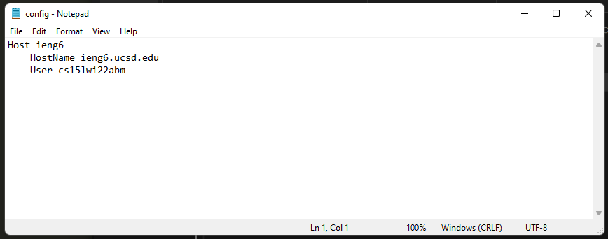
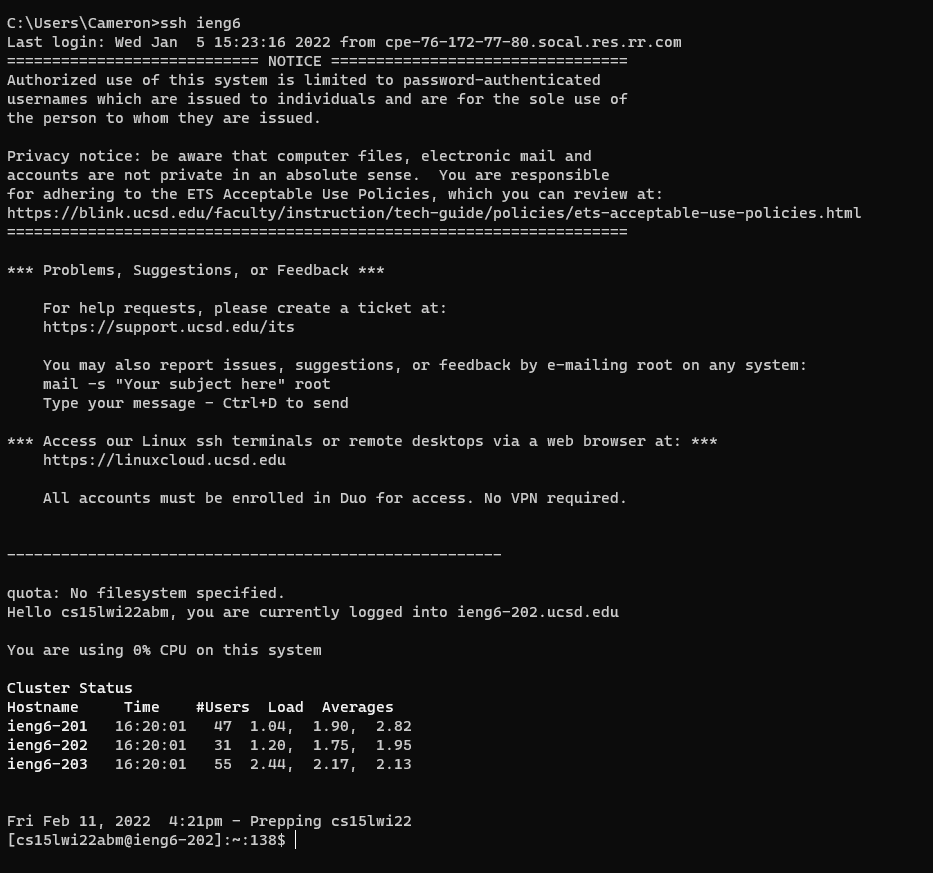
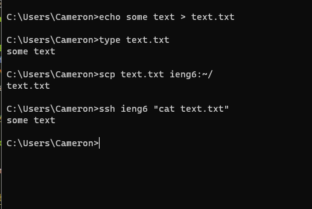

# Week 6 Lab Report: Streamlining SSH configuration

## The .ssh/config
I editing the config with notepad. Unlike Linux, the path is `C:\Users\Cameron\.ssh`. I double clicked on it then scrolled through the applications and used notepad.
 

## The ssh command logging me in
I chose the alias eing6. As I already have my private/public key pair setup with the server, no password in the config is needed

## Using scp with the alias
This makes it convenient and simple to transfer files to the remote server. 

