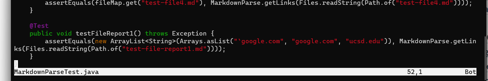
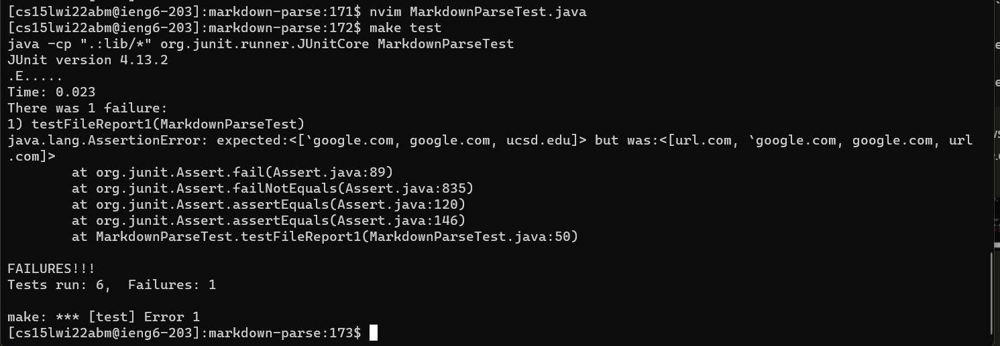
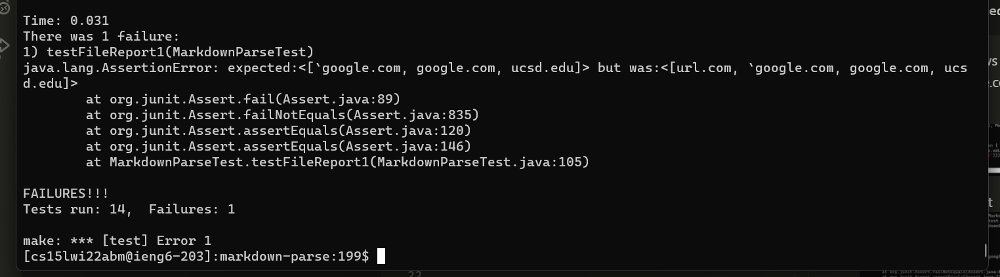
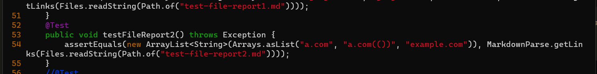
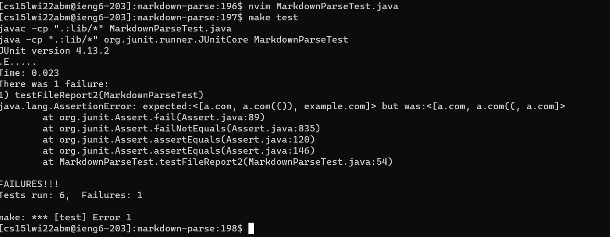
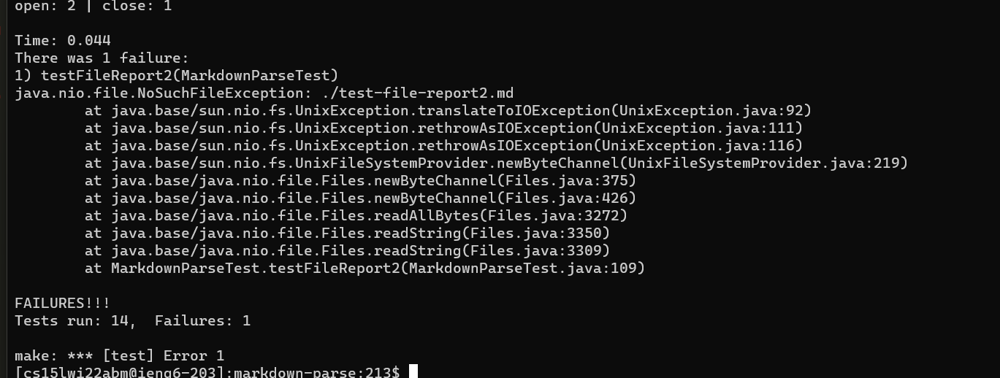
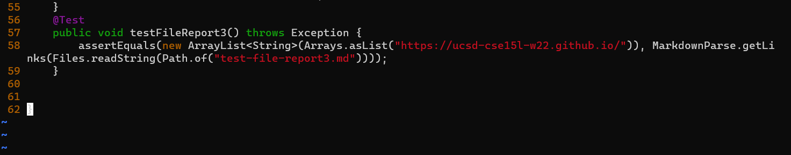
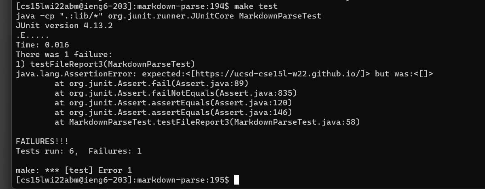
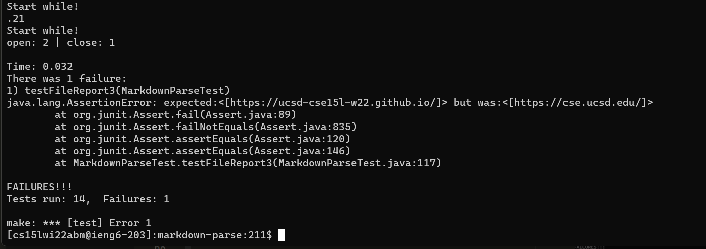

[My markdown parse](https://github.com/creikey/markdown-parse) and the [reviewed markdown parse](https://github.com/P2fryang/markdown-parse)

# Snippet 1

For snippet 1:
```
`[a link`](url.com)

[another link](`google.com)`

[`cod[e`](google.com)

[`code]`](ucsd.edu)
```

VScode preview shows that it should be [`google.com, google.com, ucsd.edu]

How I tested it:


The output of the test


The test on my repository did not pass

The output of the other repository's test


The test on the other repository didn't pass either

# Snippet 2

For snippet 2:
```
[a [nested link](a.com)](b.com)

[a nested parenthesized url](a.com(()))

[some escaped \[ brackets \]](example.com)
```

Vscode preview of what it should be:
`["a.com", "a.com(())", "example.com"]`

How I tested it:


The output of the test


The test on my repository did not pass

The output of the other repository's test


The test on the other repository didn't pass either

# Snippet 3

For snippet 3:
```
[this title text is really long and takes up more than 
one line

and has some line breaks](
    https://www.twitter.com
)

[this title text is really long and takes up more than 
one line](
    https://ucsd-cse15l-w22.github.io/
)


[this link doesn't have a closing parenthesis](github.com

And there's still some more text after that.

[this link doesn't have a closing parenthesis for a while](https://cse.ucsd.edu/


)

And then there's more text
```

Vscode preview of what it should be: `["https://ucsd-cse15l-w22.github.io/"]`

How I tested it:


The output of the test


The test on my repository did not pass

The output of the other repository's test


The test on the other repository didn't pass either

# Questions
> Do you think there is a small (<10 lines) code change that will make your program work for snippet 1 and all related cases that use inline code with backticks? If yes, describe the code change. If not, describe why it would be a more involved change.

Yes, there's a code change that could accomplish this. Make sure that the number of ` before the [ is even, or zero, that way you know the [ isn't inside a code hint. You could do this with awhile loop and traversing backwards through the file.

> Do you think there is a small (<10 lines) code change that will make your program work for snippet 2 and all related cases that nest parentheses, brackets, and escaped brackets? If yes, describe the code change. If not, describe why it would be a more involved change.

Sure, match all pairs of ( and ) within the URL then from the end position find the closing ) of the url. For the nested [, do the same thing except fail early if the next found [ comes before the next found ]

> Do you think there is a small (<10 lines) code change that will make your program work for snippet 3 and all related cases that have newlines in brackets and parentheses? If yes, describe the code change. If not, describe why it would be a more involved change.

The reason my code failed for this is it searches for spaces in the URL and fails if it finds one, and the indentation on the URL was done with spaces. This can be fixed with an easy patch where the first non-space ascii character is searched for before yanking the url.
