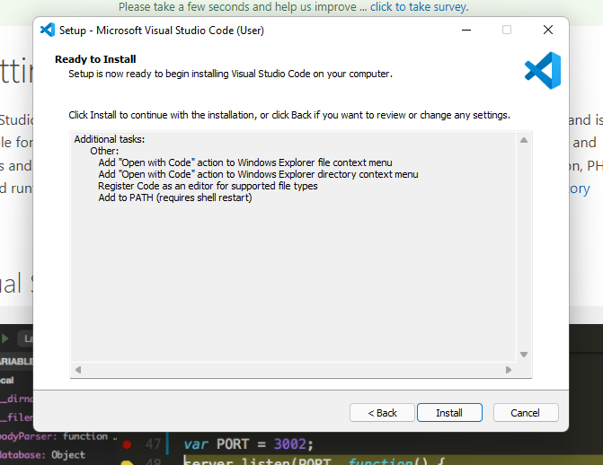
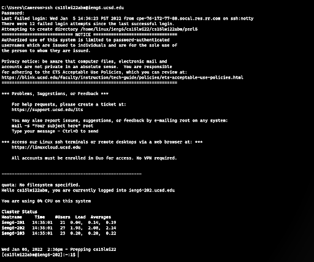
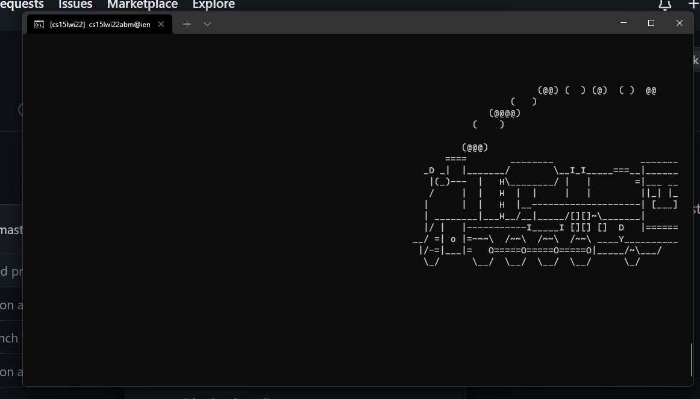
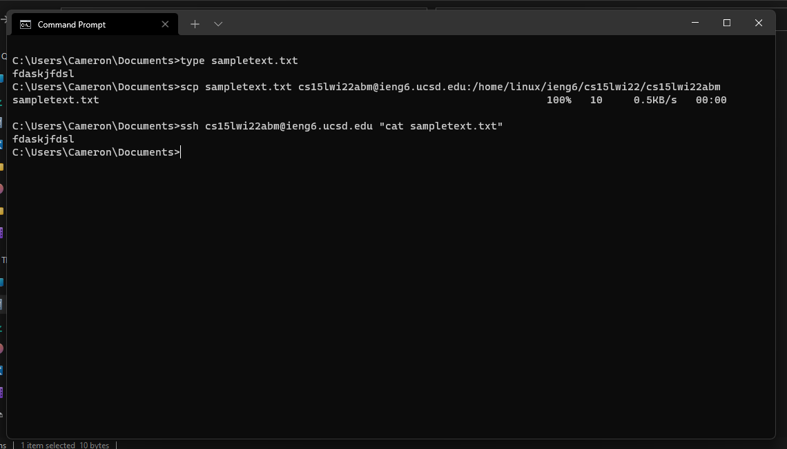
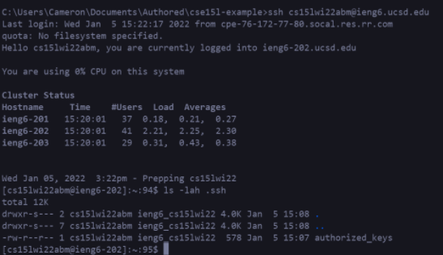
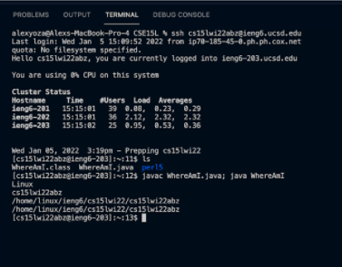

# Installing VScode
As will all great trades, you too must have great tools. Unfortunately not everybody can be great, some have to settle for less, so here is how to install Visual Studio Code. Go to [here](https://code.visualstudio.com/) click download then run the downloaded executable and follow the prompts.




# Remotely Connecting
Remotely connecting to the school servers is almost certainly more difficult than whatever work you need to do on them, so have patience.

1. If on windows [install openssh](https://docs.microsoft.com/en-us/windows-server/administration/openssh/openssh_install_firstuse)
2. [Look up your course account and change your password (if it's youre first time connecting) then wait 15 minutes](https://sdacs.ucsd.edu/~icc/index.php)
3. Now you can shell into the servers using the command `ssh cs15lwi22zz@ieng6.ucsd.ede` where zz is replaced by whatever letters are on the password reset site. You can run this either within vscode by opening the integrated terminal and running it (ctrl + `) or using windows command prompt/windows terminal

It should look like something this:


# Trying Some Commands
Try out some commands, such as `ls` to show the files in the current directory, or my favorite, `rm -f master.zip && wget https://github.com/mtoyoda/sl/archive/refs/heads/master.zip && unzip -o master.zip && cd sl-master && make && cd .. && sl-master/sl` which will show you this steam locomotive:



# Moving Files with scp
Sometimes you may be writing some code on your local computer which you want to run on the remote server, to do so you must copy the files onto the remote computer. This is accomplished with a command called `scp`. You can transfer files to the computer with this syntax:

`scp <file you want to transfer> cs15lwi22zz@ieng6.ucsd.edu:~/`

Where the zz in the `cs15lwi22zz` username part is replaced with whatever you used to ssh into it, the `<file you want to transfer>` is what you expect

Looks like this:


# Setting an SSH Key
It can be annoying to have to type your password every time you want to log in, so here's how to avoid that. On your local computer, run `ssh-keygen`, then if on windows follow [this tutorial](https://docs.microsoft.com/en-us/windows-server/administration/openssh/openssh_keymanagement#user-key-generation)

Then to set it up for access on the remote server:
1. Shell in and `mkdir .ssh`
2. Shell out then scp the id_rsa.pub file into the remote file `~/.ssh/authorized_keys`

Once it's all setup you should be able to log in like this:


# Optimizing Remote Running
This is what I used on windows to make it simpler. Setup visual studio code to run a build.bat script at the root of your project when you do Ctrl-Shift-B by Ctrl-Shift-P then type Open User Tasks, then paste this in:
```json
{
    "label": "Upload",
    "type": "shell",
    "command": ".\\build.bat",
    "presentation": {"echo": true, "reveal": "always", "focus": false, "panel": "shared", "showReuseMessage": false, "clear": true},
    "group": {"kind": "build", "isDefault": true}
}
```

An example batch script to transfer, compile, and run a java file on the remote machine
```batch
scp WhereAmI.java cs15lwi22abm@ieng6.ucsd.edu:/home/linux/ieng6/cs15lwi22/cs15lwi22abm
ssh cs15lwi22abm@ieng6.ucsd.edu "javac WhereAmI.java && java WhereAmI"
```


