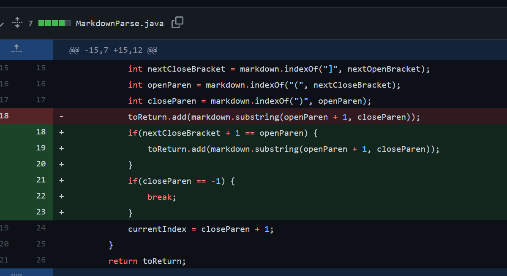
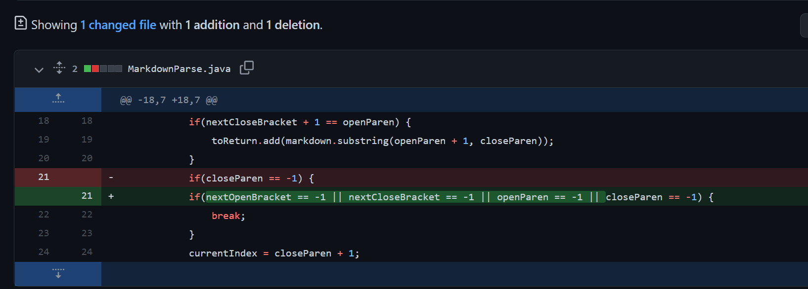

# Bug 1: Empty file bug



[link to the failure inducing input](https://github.com/creikey/markdown-parse/commit/d57f34d3f6f4430315278e30a977958b31a1433a)

Symptom of the failure:
```
Error:
Exception in thread "main" java.lang.StringIndexOutOfBoundsException: begin 0, end -1, length 12
        at java.base/java.lang.String.checkBoundsBeginEnd(String.java:4601)
        at java.base/java.lang.String.substring(String.java:2704)
        at MarkdownParse.getLinks(MarkdownParse.java:18)
        at MarkdownParse.main(MarkdownParse.java:26)
```

If `indexOf` cannot find the character you're looking for, it'll return -1. This
causes symptoms like the stacktrace of the bug where it'll try to substring from
that negative index. The fix is to check for this and break early if this is the
case.


# Bug 2: Text including brackets and parenthesis bug

This screenshot is the same as the first one as the commit has both changes in one.
The Exact change that fixed the issue was
```Java
if(nextCloseBracket + 1 == openParen) {
    toReturn.add(markdown.substring(openParen + 1, closeParen));
}
```


[link to the failure inducing input](https://github.com/creikey/markdown-parse/blob/main/test-file3.md)

Symptom of the failure:
```
[parenthesis]
```

This should've been the empty ArrayList `[]`

The code checked for the next open parenthesis any
number of characters after the closing bracket of the url text. This means
text like in the example document was incorrectly classified as a URL. To fix
this bug, it can simply be ensured that the open parenthesis found is directly after
the closing bracket. 


# Bug 3: Infinite loop



[link to the failure inducing input](https://github.com/creikey/markdown-parse/blob/main/test-file4.md)

Symptom of the failure:
```
```
No output would print while the program infinitely stalls

Sometimes the next open bracket would not be found, causing the close parenthesis to search
from the index of -1, meaning it would rewind to find the bracket it already found, causing the program to infinitely loop. To fix this all of the indices found can be explicitly checked to see if they didn't find anything.